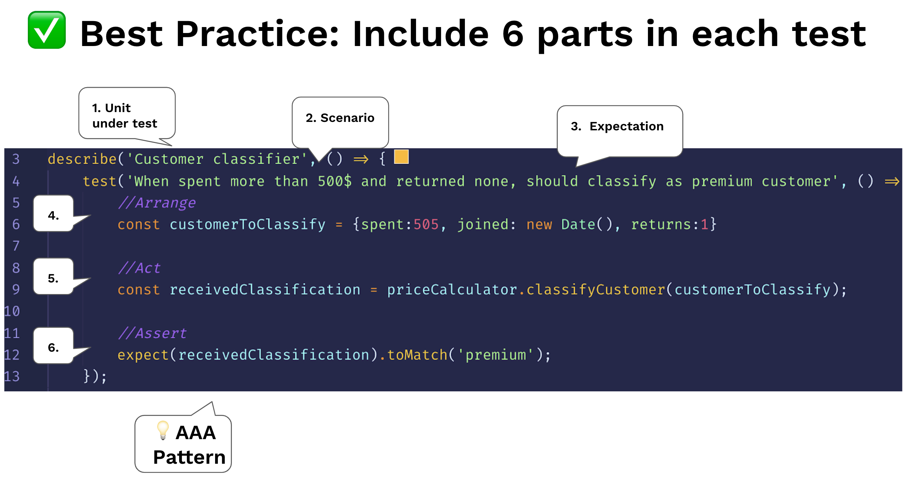

# Testy struktury według wzorca AAA

<br/><br/>

### Wyjaśnienie jednym akapitem
Naszym największym wyzwaniem do testowania jest brak przestrzeni nad głową - już mamy kod produkcyjny, który sprawia, że jesteśmy bardzo zajęci. Z tego powodu kod testowy musi pozostać śmiertelnie prosty i łatwy do zrozumienia. Podczas czytania przypadku testowego - nie powinno to przypominać czytania kodu imperatywnego (pętli, dziedziczenia), a raczej HTML - deklaratywne doświadczenie. Aby to osiągnąć, zachowaj konwencję AAA, aby czytelnicy mogli bez wysiłku przeanalizować cel testu. Istnieją inne podobne formaty tego wzorca, takie jak XUnit „Setup, Excercise, Verify, Teardown”. Oto trzy A:

Pierwsze A - Arrange: Cały kod instalacyjny, aby wprowadzić system do scenariusza, który test ma na celu symulację. Może to obejmować tworzenie instancji testowanego konstruktora, dodawanie rekordów BD, mockowanie/stubbing obiektów i dowolny inny kod przygotowawczy

Drugie A - Act: Wykonaj unit pod test. Zwykle 1 linia kodu

Trzecie A - Assert: Upewnij się, że otrzymana wartość spełnia oczekiwania. Zwykle 1 linia kodu


<br/><br/>

### Przykład kodu: test o strukturze wzorca AAA
```javascript
describe.skip('Customer classifier', () => {
    test('When customer spent more than 500$, should be classified as premium', () => {
        //Arrange
        const customerToClassify = {spent:505, joined: new Date(), id:1}
        const DBStub = sinon.stub(dataAccess, 'getCustomer')
            .reply({id:1, classification: 'regular'});

        //Act
        const receivedClassification = customerClassifier.classifyCustomer(customerToClassify);

        //Assert
        expect(receivedClassification).toMatch('premium');
    });
});
```

<br/><br/>

### Przykład kodu - Antywzorzec: bez separacji, jedna masa, trudniejsza do interpretacji
```javascript
test('Should be classified as premium', () => {
        const customerToClassify = {spent:505, joined: new Date(), id:1}
        const DBStub = sinon.stub(dataAccess, 'getCustomer')
            .reply({id:1, classification: 'regular'});
        const receivedClassification = customerClassifier.classifyCustomer(customerToClassify);
        expect(receivedClassification).toMatch('premium');
    });
```

<br/><br/>

###  "Uwzględnij 6 części w każdym teście"

 [Z bloga "30 Node.js testing best practices" od Yoni Goldberg](https://medium.com/@me_37286/yoni-goldberg-javascript-nodejs-testing-best-practices-2b98924c9347)

 

<br/><br/>

### "Ważne jest, aby sprawdzający testy mógł szybko określić, jakie zachowanie weryfikuje test"
Z książki [XUnit Patterns](http://xunitpatterns.com/Four%20Phase%20Test.html):

> It is important for the test reader to be able to quickly determine what behavior the test is verifying. It can be very confusing when various behaviors of the system under test (SUT) are being invoked, some to set up the pre-test state (fixture) of the SUT, others to exercise the SUT and yet others to verify the post-test state of the SUT. Clearly identifying the four phases makes the intent of the test much easier to see.
