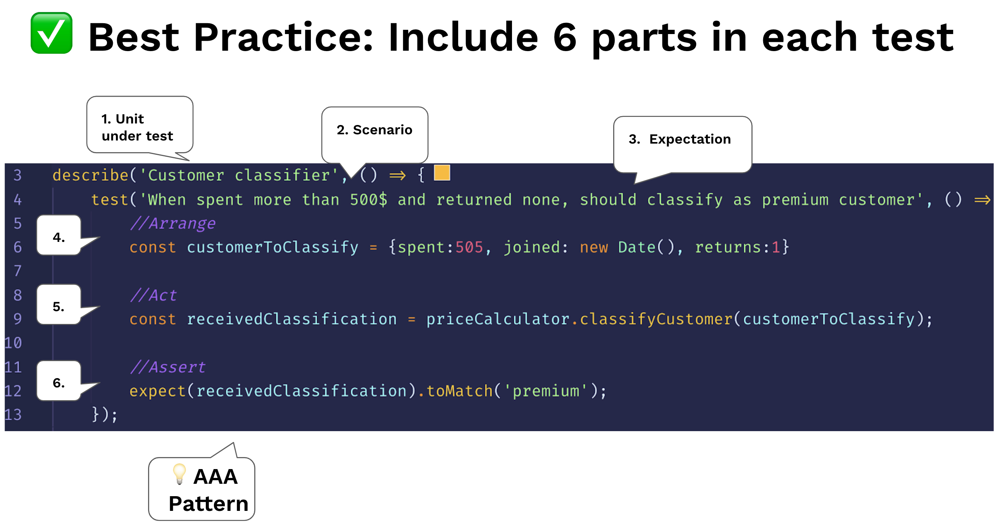

# Структуруйте тести за патерном AAA

<br/><br/>

### Пояснення за один абзац
Наш найбільший виклик у тестуванні — це брак ментального простору — у нас і так вистачає роботи з продакшн-кодом. З цієї причини код тестів повинен залишатися максимально простим і легким для розуміння. При читанні тестового випадку — це не повинно здаватися читанням імперативного коду (цикли, наслідування), а скоріше як HTML — декларативний досвід. Щоб досягти цього, дотримуйтесь конвенції AAA, щоб розум читача без зусиль парсив намір тесту. Існують деякі інші подібні формати цього патерну, такі як XUnit 'Setup, Exercise, Verify, Teardown'. Ось три A:

Перша A - Arrange (Підготовка): Весь код налаштування для приведення системи до сценарію, який тест має на меті симулювати. Це може включати інстанціювання конструктора тестованого модуля, додавання записів до БД, мокінг/стабінг об'єктів та будь-який інший підготовчий код

Друга A - Act (Дія): Виконання тестованого модуля. Зазвичай 1 рядок коду

Третя A - Assert (Перевірка): Переконайтеся, що отримане значення відповідає очікуванню. Зазвичай 1 рядок коду


<br/><br/>

### Приклад коду: тест, структурований за патерном AAA
```javascript
describe.skip('Customer classifier', () => {
    test('When customer spent more than 500$, should be classified as premium', () => {
        //Arrange
        const customerToClassify = {spent:505, joined: new Date(), id:1}
        const DBStub = sinon.stub(dataAccess, 'getCustomer')
            .reply({id:1, classification: 'regular'});

        //Act
        const receivedClassification = customerClassifier.classifyCustomer(customerToClassify);

        //Assert
        expect(receivedClassification).toMatch('premium');
    });
});
```

<br/><br/>

### Приклад коду – Антипатерн: без розділення, один блок, важче інтерпретувати
```javascript
test('Should be classified as premium', () => {
    const customerToClassify = {spent:505, joined: new Date(), id:1}
    const DBStub = sinon.stub(dataAccess, 'getCustomer')
        .reply({id:1, classification: 'regular'});
    const receivedClassification = customerClassifier.classifyCustomer(customerToClassify);
    expect(receivedClassification).toMatch('premium');
});
```

<br/><br/>

###  "Включіть 6 частин у кожен тест"

 [З блогу "30 Node.js testing best practices" від Yoni Goldberg](https://medium.com/@me_37286/yoni-goldberg-javascript-nodejs-testing-best-practices-2b98924c9347)

 

<br/><br/>

### "Важливо, щоб читач тесту міг швидко визначити, яку поведінку тест перевіряє"
З книги [XUnit Patterns](http://xunitpatterns.com/Four%20Phase%20Test.html):

> Важливо, щоб читач тесту міг швидко визначити, яку поведінку тест перевіряє. Це може бути дуже заплутано, коли викликаються різні поведінки системи, що тестується (SUT), деякі для налаштування стану перед тестом (фікстури) SUT, інші для виконання SUT і ще інші для перевірки стану після тесту SUT. Чітке визначення чотирьох фаз робить намір тесту набагато легшим для розуміння.

<br/><br/>

### "Корисна техніка [...] полягає в тому, що написання Assert першим — чудове місце для початку."
Зі статті [Arrange, Act, Assert](https://xp123.com/articles/3a-arrange-act-assert/) від Bill Wake, який вперше спостеріг і назвав цей патерн

> **З чого почати?**
>
> Ви можете подумати, що Arrange — це природна річ для написання першою, оскільки вона йде першою.
Коли я систематично опрацьовую поведінку об'єкта, я можу написати рядок Act першим.
>
> Але корисна техніка, яку я вивчив від Jim Newkirk, полягає в тому, що написання Assert першим — чудове місце для початку. Коли у вас є нова поведінка, яку ви знаєте, що хочете протестувати, Assert First дозволяє почати із запитання "Припустимо, це спрацювало; як би я міг це визначити?" З Assert на місці, ви можете робити те, що Industrial Logic називає "Frame First" і покладатися на IDE для "заповнення пробілів."

<br/><br/>

### "Коли ви звикнете до цього патерну, ви зможете читати і розуміти тести легше"
З книги [Unit Testing, Principles, Practices, and Patterns](https://freecontent.manning.com/making-better-unit-tests-part-1-the-aaa-pattern/)
> Патерн 3A простий і забезпечує уніфіковану структуру для всіх тестів у наборі. Ця уніфікована структура є однією з його найбільших переваг: коли ви звикнете до цього патерну, ви зможете читати і розуміти тести легше. Це, в свою чергу, зменшує витрати на підтримку всього вашого тестового набору.

