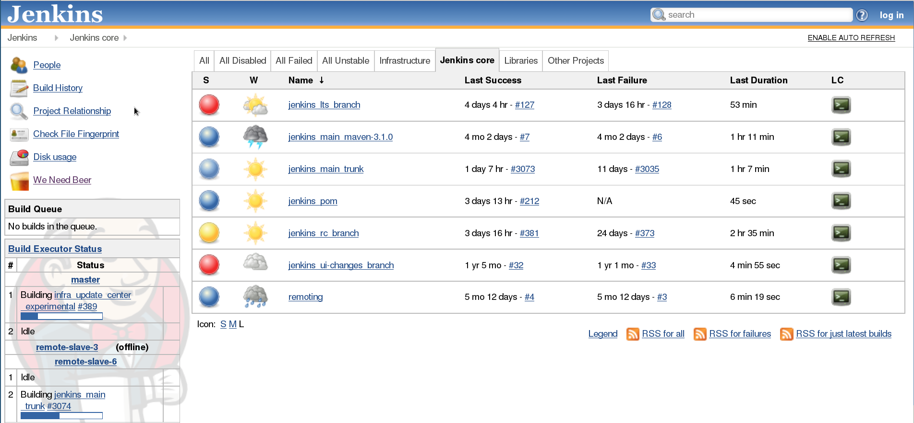

# CI プラットフォームを慎重に選択する

<br/><br/>

### 一段落説明

CI の世界において、かつては [Jenkins](https://jenkins.io/) の柔軟性と SaaS のシンプルさが争っていました。ところが、[CircleCI](https://circleci.com/) や [Travis](https://travis-ci.org/) のような SaaS プロバイダが Docker コンテナを含む堅牢なソリューションを最小限のセットアップ時間で提供しているのに対し、Jenkins は「シンプルさ」の面で勝負しようとしているため、ゲームは変化してきています。一方はクラウド上でリッチな CI ソリューションをセットアップすることができますが、細かな設定の制御が必要な場合には、Jenkins は依然として選択肢になります。どれを選択するかは、結局どの程度 CI プロセスをカスタマイズするかに帰結します: 無料かつ設定不要なクラウド型は、独自のシェルコマンド、独自の Docker イメージ、ワークフローの調整、マトリックスビルドの実行やその他リッチな機能を利用できます。しかしながら、インフラをコントロールして CI ロジックを Java のような正式なプログラミング言語を用いてプログラミングしたい場合には、Jenkins を選択するのがよいかもしれません。それ以外の場合は、シンプルで設定不要のクラウド型を選択することを検討してください。

<br/><br/>

### コード例 – 一般的なクラウドの CI 設定。一つの .yml ファイル、たったそれだけ

```yaml
version: 2
jobs:
  build:
    docker:
      - image: circleci/node:4.8.2
      - image: mongo:3.4.4
    steps:
      - checkout
      - run:
          name: Install npm wee
          command: npm install
  test:
    docker:
      - image: circleci/node:4.8.2
      - image: mongo:3.4.4
    steps:
      - checkout
      - run:
          name: Test
          command: npm test
      - run:
          name: Generate code coverage
          command: './node_modules/.bin/nyc report --reporter=text-lcov'      
      - store_artifacts:
          path: coverage
          prefix: coverage

```

### Circle CI - ほぼ設定の必要ないクラウド CI


### Jenkins - 洗練された、堅牢な CI



<br/><br/>
