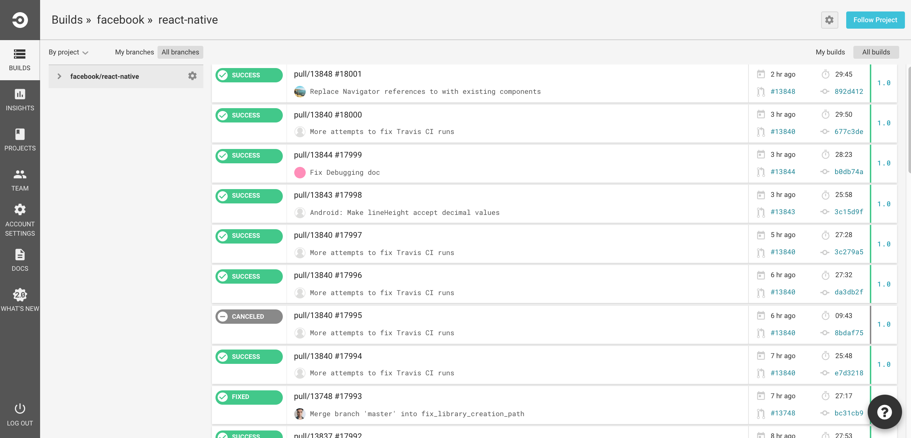

# CI 플랫폼을 신중하게 선택하라.

<br/><br/>

### 한 문단 요약

CI 세계는 주로 적용성의 Jenkins와, 단순함의 SaaS 업체들로 나뉘어 사용되어져 왔다. Jenkins가 '단순함'의 부문에서도 경쟁하려고 시도하는 동안,  CircleCI 와 Travis 같은 SaaS 공급자들이 최소한의 설치 시간을 가진 도커 컨테이너를 포함한 광범위하고 고성능을 가진 솔루션을 제공하면서 이제 게임이 변화하기 시작했다. 비록 클라우드에서 풍부한 CI 솔루션을 설치할 수 있지만, 정밀한 조절을 요하는 경우에는 여전히 Jenkins는 선택에 들어가게 되는 플랫폼이다. 결국 선택은 CI 프로세스를 커스터마이즈해야 하는 범위로 결정된다. 무료 및 설정 무료 클라우드 공급 업체들은 사용자 지정 shell 명령들, 사용자 지정 도커 이미지 실행, 워크플로우 조정, 매트릭스 빌드 등의 풍부한 기능 실행을 허용한다. 하지만, 만약 인프라를 컨트롤하거나 Java와 같은 일반적인 프로그래밍 언어를 사용해 CI 로직을 프로그래밍하는 것이 요구된다면, Jenkins가 선택지가 될 수 있다. 그렇지 않다면, 간단하고 설정이 자유로운 클라우드 옵션 선택에 대해 고려해보라.

<br/><br/>

### 코드 예제 - 전형적인 cloud CI configuration. 하나의 .yml 파일이다.

```javascript
version: 2
jobs:
  build:
    docker:
      - image: circleci/node:4.8.2
      - image: mongo:3.4.4
    steps:
      - checkout
      - run:
          name: Install npm wee
          command: npm install
  test:
    docker:
      - image: circleci/node:4.8.2
      - image: mongo:3.4.4
    steps:
      - checkout
      - run:
          name: Test
          command: npm test
      - run:
          name: Generate code coverage
          command: './node_modules/.bin/nyc report --reporter=text-lcov'      
      - store_artifacts:
          path: coverage
          prefix: coverage

```

### Circle CI - 사실상 설치가 없다시피 한 cloud CI



### Jenkins - 예리하고 광범위하며, 고성능을 가진 CI


<br/><br/>
