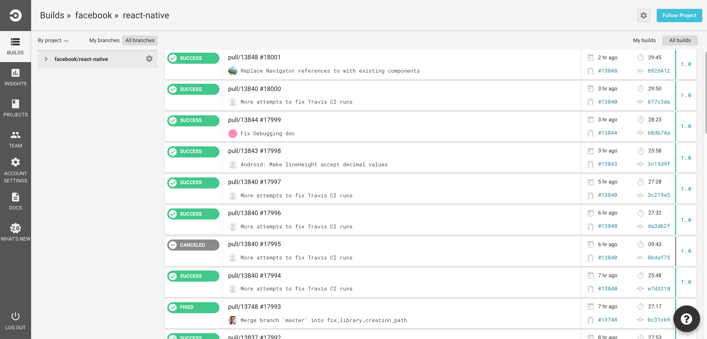
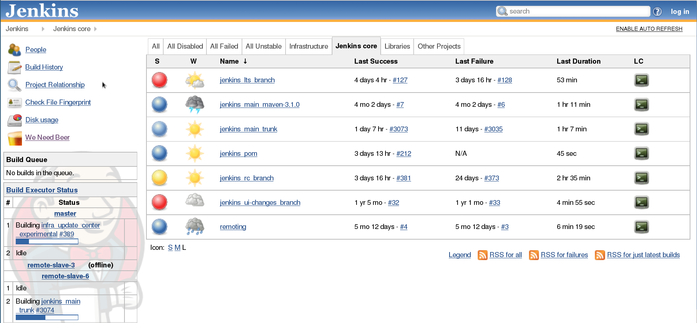

# Ostrożnie wybierz swoją platformę CI

<br/><br/>

### Wyjaśnienie jednym akapitem

Świat CI był kiedyś elastyczny [Jenkins](https://jenkins.io/) vs prostota dostawców SaaS. Gra się teraz zmienia, ponieważ dostawcy SaaS, tacy jak [CircleCI](https://circleci.com/) i [Travis](https://travis-ci.org/), oferują solidne rozwiązania, w tym kontenery Docker z minimalnym czasem instalacji, podczas gdy Jenkins stara się także konkurować w segmencie „prostoty”. Chociaż można skonfigurować bogate rozwiązanie CI w chmurze, to gdyby wymagało to kontrolowania najdrobniejszych szczegółów, Jenkins jest nadal preferowaną platformą. Wybór ostatecznie sprowadza się do tego, w jakim stopniu proces CI powinien być dostosowany: darmowi i konfigurujący dostawcy darmowej chmury pozwalają na uruchamianie niestandardowych poleceń powłoki, niestandardowych obrazów dokerów, dostosowywanie przepływu pracy, uruchamianie kompilacji macierzy i innych bogatych funkcji. Jeśli jednak konieczne jest kontrolowanie infrastruktury lub programowanie logiki CI za pomocą formalnego języka programowania, takiego jak Java, Jenkins może nadal być wyborem. W przeciwnym razie rozważ wybranie prostej i skonfiguruj opcję bezpłatnej chmury

<br/><br/>

### Przykład kodu - typowa konfiguracja CI w chmurze. Pojedynczy plik .yml i to wszystko

```yaml
version: 2
jobs:
  build:
    docker:
      - image: circleci/node:4.8.2
      - image: mongo:3.4.4
    steps:
      - checkout
      - run:
          name: Install npm wee
          command: npm install
  test:
    docker:
      - image: circleci/node:4.8.2
      - image: mongo:3.4.4
    steps:
      - checkout
      - run:
          name: Test
          command: npm test
      - run:
          name: Generate code coverage
          command: './node_modules/.bin/nyc report --reporter=text-lcov'      
      - store_artifacts:
          path: coverage
          prefix: coverage

```

### Circle CI - prawie zerowa konfiguracja CI w chmurze



### Jenkins - wyrafinowany i solidny CI



<br/><br/>
