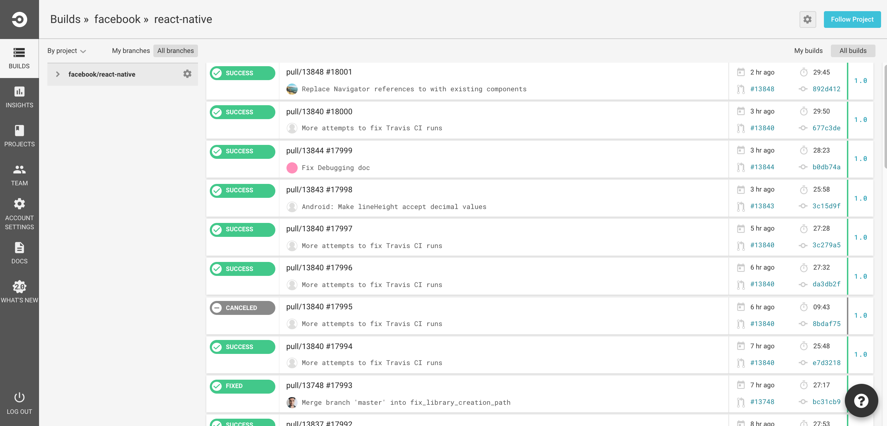
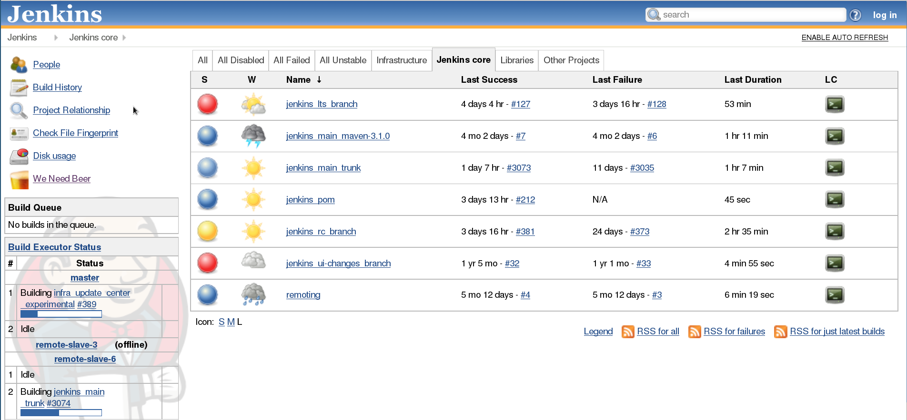

# Ретельно обирайте свою CI платформу

<br/><br/>

### Пояснення за один абзац

Світ CI раніше полягав у гнучкості [Jenkins](https://jenkins.io/) проти простоти SaaS-постачальників. Гра тепер змінюється, оскільки SaaS-постачальники, такі як [CircleCI](https://circleci.com/) та [Travis](https://travis-ci.org/), пропонують надійні рішення, включаючи Docker-контейнери з мінімальним часом налаштування, тоді як Jenkins намагається конкурувати в сегменті "простоти". Хоча можна налаштувати багатофункціональне CI-рішення в хмарі, якщо потрібно контролювати найдрібніші деталі, Jenkins все ще є платформою вибору. Вибір в кінцевому підсумку зводиться до того, наскільки CI-процес повинен бути налаштований: безкоштовні хмарні постачальники без налаштування дозволяють запускати власні shell-команди, власні docker-образи, налаштовувати робочий процес, запускати матричні збірки та інші багатофункціональні можливості. Однак, якщо бажано контролювати інфраструктуру або програмувати логіку CI за допомогою формальної мови програмування, такої як Java — Jenkins все ще може бути вибором. В іншому випадку розгляньте вибір простого та безкоштовного хмарного варіанту без налаштування

<br/><br/>

### Приклад коду – типова конфігурація хмарного CI. Один файл .yml і це все

```yaml
version: 2
jobs:
  build:
    docker:
      - image: circleci/node:4.8.2
      - image: mongo:3.4.4
    steps:
      - checkout
      - run:
          name: Install npm wee
          command: npm install
  test:
    docker:
      - image: circleci/node:4.8.2
      - image: mongo:3.4.4
    steps:
      - checkout
      - run:
          name: Test
          command: npm test
      - run:
          name: Generate code coverage
          command: './node_modules/.bin/nyc report --reporter=text-lcov'      
      - store_artifacts:
          path: coverage
          prefix: coverage

```

### Circle CI - майже нульове налаштування хмарного CI



### Jenkins - складний та надійний CI



<br/><br/>

