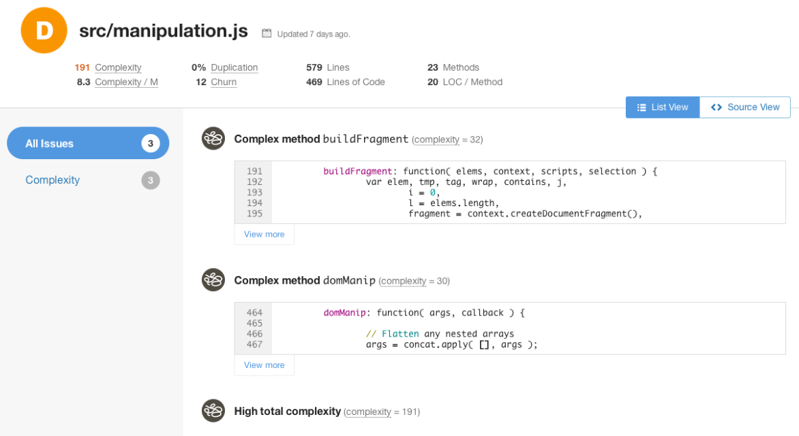
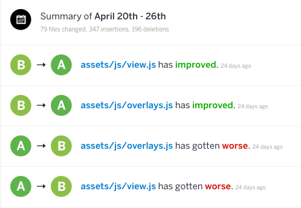
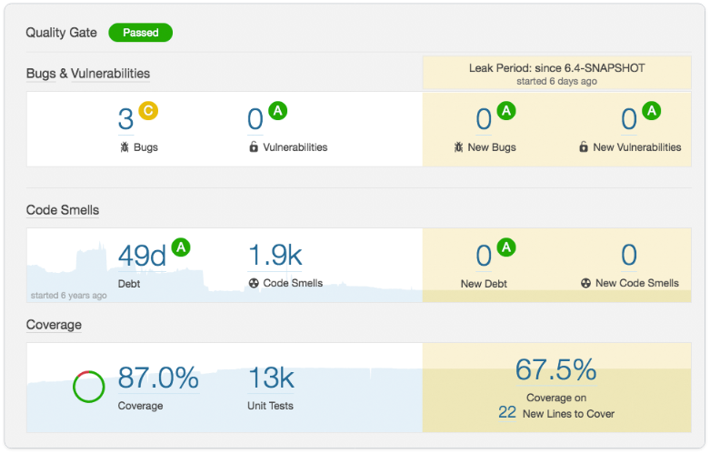

# Refactorisation

  

### Un paragraphe d'explication

La refactorisation est un processus important dans le flux de développement itératif. La suppression des « Code Smells » (mauvaises pratiques de codage) telles que le code dupliqué, les trop longues méthodes et la trop longue liste de paramètre améliorera votre code et le rendra plus maintenable. L'utilisation d'outils d'analyse statique vous aidera à trouver ces « Code Smells » et à créer un processus de refactorisation. L'ajout de ces outils à votre CI aidera à automatiser le processus de vérification de la qualité. Si votre CI s'intègre à un outil comme Sonar ou Code Climate, la construction échouera s'il détecte des « Code Smells » et informera l'auteur sur la façon de résoudre le problème. Ces outils d'analyse statique complèteront les outils de Lint tels que ESLint. La plupart des outils de Lint se concentreront sur les styles de code comme l'indentation et les points-virgules manquants (bien que certains trouveront des « Code Smells » comme les fonctions trop longues) dans un seul fichier tandis que les outils d'analyse statique se concentreront sur la recherche de « Code Smell » (code en double, analyse de complexité, etc.) qui sont dans des fichiers uniques et dans plusieurs fichiers.

  

### Martin Fowler - Scientifique en chef à ThoughtWorks

 Extrait du livre, « Refactorisation - Amélioration de la conception du code existant »

 > La refactorisation est une technique contrôlée pour améliorer la conception d'une base de code existante.

  

### Evan Burchard - Auteur et consultant en développement web

 Extrait du livre, « Refactorisation JavaScript : transformer un mauvais code en bon code »

> Quel que soit le framework,
le langage ou la bibliothèque « compile-en-JS » que vous utilisez, les bogues et les problèmes de performances
seront toujours un problème si la qualité implicite de votre JavaScript est mauvaise.

  

 ### Exemple : analyse de méthodes complexes avec CodeClimate (commercial)

### Exemple : tendances et historique de l'analyse de code avec CodeClimate (commercial)

### Exemple : résumé et tendances de l'analyse de code avec SonarQube (commercial)

  
